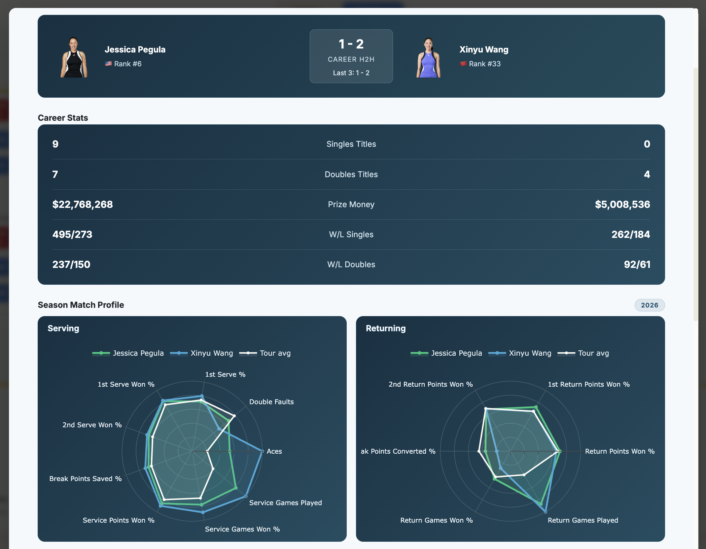
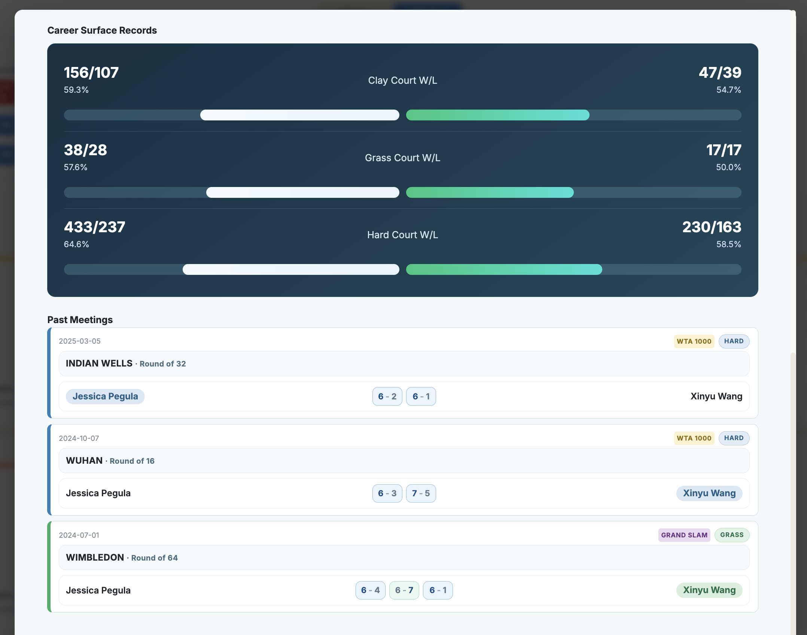
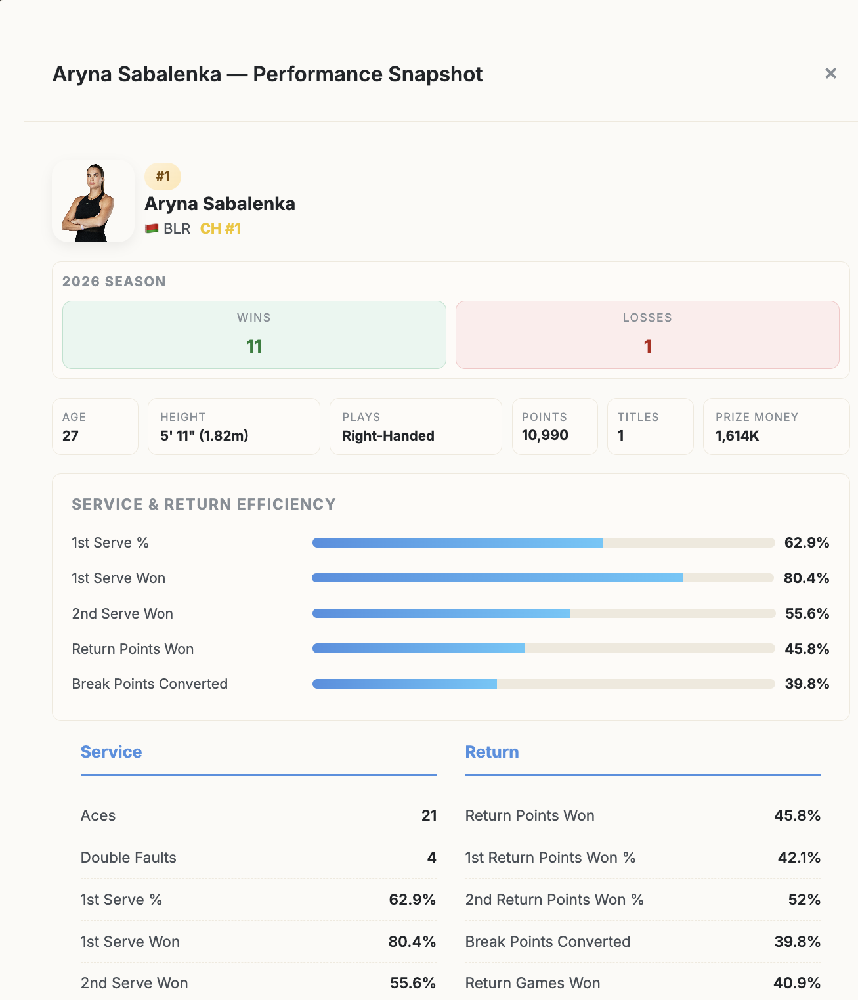
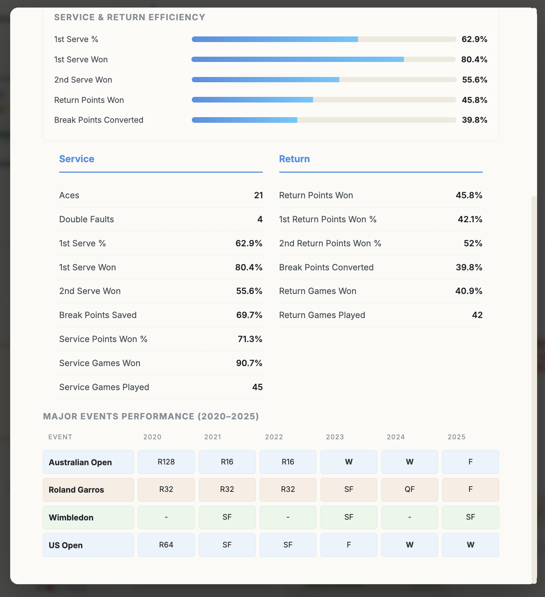
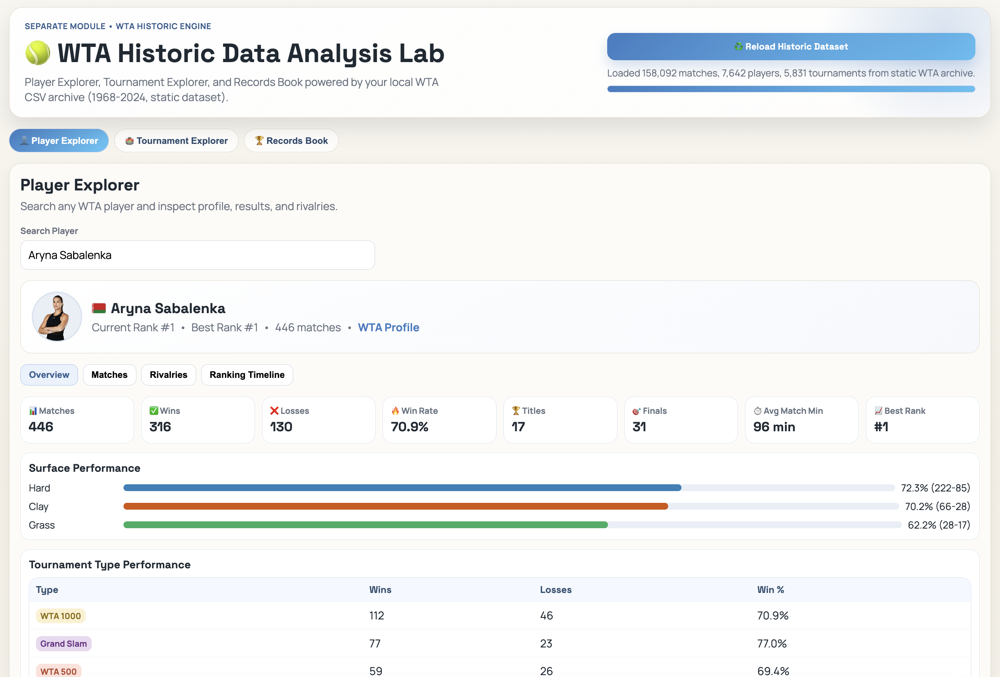
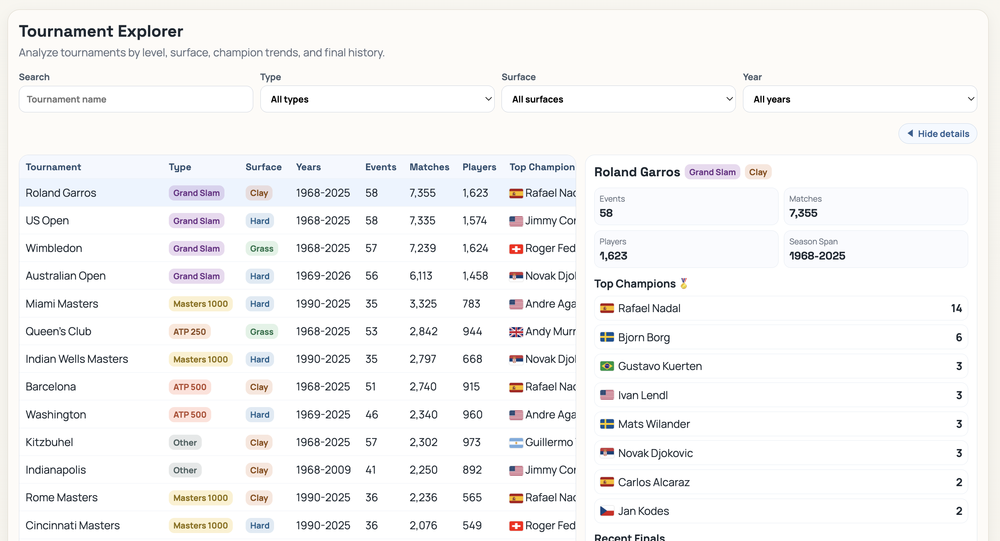
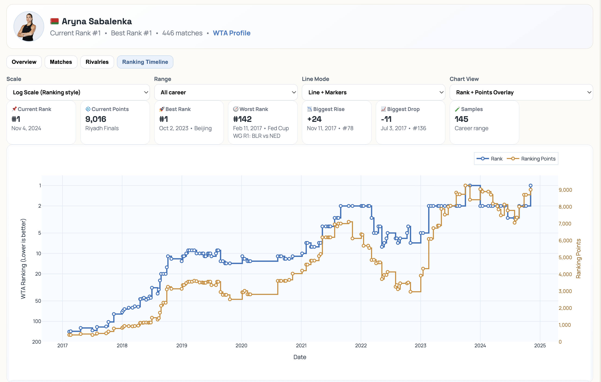

# 🎾 Tennis Live Dashboard

**Real-time ATP & WTA Tennis Tracking for 2026**

[](https://www.python.org/) [](https://flask.palletsprojects.com/) [](LICENSE) [](https://tennis-tour-dashboard.onrender.com)

*Your all-in-one tennis companion for live scores, rankings, tournament insights, player analytics, and smart notifications.*

---

## ✨ Features

### 🔴 Live Match Tracking

-   Real-time ATP/WTA live scores with server/game-point context.
-   Auto-refresh via SocketIO with polling fallback.

### 📊 Match Coverage

-   Recently finished matches with quick stat breakdowns.
-   Upcoming matches (next 2 days) with H2H/prediction insights.

### 🏆 Rankings & Tournaments

-   ATP/WTA rankings with update status and refresh actions.
-   Tournament calendar + bracket viewer with round points/prize context.

### ⚔️ H2H Analytics

-   ATP and WTA search + head-to-head comparison.
-   Surface splits, trends, and radar-style metrics.

### 👤 Player Profiles

-   Profile cards, country flags, image fallback, and stat summaries.
-   Match-level details integrated with dashboard views.

### 📈 Data Analysis Dashboard

-   Dedicated ATP/WTA analysis workspace (`/analysis/atp`, `/analysis/wta`).
-   Player Explorer, Tournament Explorer, and Records Book.

### 🔔 Smart Notification System

-   Multi-rule alert engine with guided rule builder.
-   Event types for upcoming/live/result/milestone-style triggers.
-   Channels: Email + integrations, cooldowns, quiet hours, run-now testing.
-   Launchable from main dashboard button (auto-start helper route).

---

## 🚀 Quick Start

### 🌐 Live Demo

Visit: **[tennis-tour-dashboard.onrender.com](https://tennis-tour-dashboard.onrender.com)**

### 💻 Local Development

#### 1. Option A: Quick Start Script

```bash
./start.sh
```

#### 2. Option B: Manual Setup

Backend:

```bash
cd backendpython3 -m venv venvsource venv/bin/activate  # Windows: venvScriptsactivatepip install -r requirements.txtpython app.py
```

Frontend (new terminal):

```bash
cd frontendpython3 no_cache_server.py
```

Default local URLs:

-   Frontend: `http://localhost:8085`
-   Backend: `http://localhost:5001`
-   Notification app: `http://localhost:5090`

---

## 🛠️ Tech Stack

### Backend

-    Python 3.11+
-    Flask + Flask-SocketIO
-      Requests / BeautifulSoup / Playwright-based data flows

### Frontend

-      HTML/CSS/Vanilla JS (modular files)
-    Interactive charts/visualizations + custom UI components

### Deployment

-    Render.com (Python service)
-    GitHub for source and CI flow

---

## 📡 API Endpoints

### Core Endpoints

Method

Endpoint

Description

`GET`

`/api/health`

Health check ✅

`GET`

`/api/live-scores?tour=atp|wta|both`

Live match scores 🔴

`GET`

`/api/recent-matches?tour=...&limit=...`

Recently completed matches 📋

`GET`

`/api/upcoming-matches?tour=...&days=7`

Upcoming matches 🎯

`GET`

`/api/intro-gifs`

Intro GIF list 🖼️

### Rankings & Players

Method

Endpoint

Description

`GET`

`/api/rankings/<tour>?limit=...`

ATP/WTA rankings 🏆

`GET`

`/api/rankings/atp/status`

ATP rankings status ⏰

`POST`

`/api/rankings/atp/refresh`

Refresh ATP rankings 🔄

`GET`

`/api/rankings/wta/status`

WTA rankings status ⏰

`POST`

`/api/rankings/wta/refresh`

Refresh WTA rankings 🔄

`GET`

`/api/player/<id>`

Player profile 👤

`GET`

`/api/player/<tour>/<player_id>/image`

Player image route 📸

### Tournaments & Brackets

Method

Endpoint

Description

`GET`

`/api/tournaments/<tour>`

Tournament calendar 📅

`GET`

`/api/tournament/<id>/bracket?tour=...`

Tournament bracket 🌳

`GET`

`/api/categories`

Category list 🏷️

### Head-to-Head

Method

Endpoint

Description

`GET`

`/api/h2h/atp/search?query=...&limit=...`

ATP player search 🔍

`GET`

`/api/h2h/wta/search?query=...&limit=...`

WTA player search 🔍

`GET`

`/api/h2h/atp?player1_id=...&player2_id=...`

ATP H2H ⚔️

`GET`

`/api/h2h/wta?player1_id=...&player2_id=...&year=2026&meetings=5`

WTA H2H ⚔️

### System Management

Method

Endpoint

Description

`GET`

`/api/system/analysis`

Update analysis summary 📈

`POST`

`/api/system/update`

Trigger update pipeline 🔄

`GET`

`/api/system/update/status`

Update progress 📊

`GET`

`/api/notifications/status`

Notification service status 🔔

`POST`

`/api/notifications/launch`

Launch notification service 🚀

`GET`

`/notifications/open`

Open notification page 🌐

### 🔔 Notification System Endpoints (port `5090`)

Method

Endpoint

Description

`GET`

`/api/state`

State: settings/rules/history/config ⚙️

`POST`

`/api/settings`

Save delivery settings 📝

`GET`

`/api/options`

Player/tournament options 🔍

`POST`

`/api/rules`

Create rule ✨

`PUT`

`/api/rules/<rule_id>`

Update rule 🔧

`DELETE`

`/api/rules/<rule_id>`

Delete rule 🗑️

`POST`

`/api/run-now`

Manual run 🚀

`POST`

`/api/test-email`

Send test email 📧

`POST`

`/api/history/clear`

Clear run history 🔄

---

## 📁 Project Structure

```bash
Tennis-Dashboard/├── backend/│   ├── app.py│   ├── tennis_api.py│   ├── config.py│   ├── requirements.txt│   └── notification_system/│       ├── app.py│       ├── storage/subscriptions.json│       ├── templates/index.html│       └── static/{app.js,styles.css,favicon.svg}├── frontend/│   ├── index.html│   ├── update.html│   ├── no_cache_server.py│   ├── css/│   ├── js/│   └── vendor/├── data/├── data_analysis/├── scripts/├── Images/├── start.sh├── start_local.sh├── README.md├── LICENSE└── .gitignore
```

---

## 📸 Interface Gallery

Title

Preview

Description

Loading Intro


Animated intro with branded loading cues.

Main Interface


Live scores, recent results, and upcoming matches in one view.

Main Interface (Alt)


Alternative layout emphasizing cards and quick stats.

Upcoming Match Insights


Prediction cards with H2H, form, and surface context.

Live Rankings and Calendar


Rankings status plus calendar and bracket access.

Favourites Panel


Pinned players with quick jump and snapshot stats.

H2H Analytics



Head-to-head overview with key metrics.

H2H Analytics (Cont.)



Side-by-side comparison with trend indicators.

Player Stats



Player bio card with season and surface splits.

Player Stats  
(Cont.)



Expanded stat blocks and recent form panel.

**Stats Table**


Dense comparison table for match and season stats.

**Serving Stats Index**


Serving KPI index with percentile bars.

Notification System


Rules list, toggles, and live run controls.

Notification System (Detail)


Rule builder with filters, channels, and timing.

---

## 📊 Data Analysis Dashboard

Title

Preview

Description

Player Analysis



Player explorer with filters and trend charts.

Player Analysis - Additional View


Deep-dive view with profile and stat panels.

Player Analysis - Advanced Metrics


Advanced metrics and radar comparisons.

Player Match Analysis


Match-by-match breakdown with surface splits.

Tournament Analysis



Tournament explorer with draws and stats.

Records Book


All-time records with holders and context.

Ranking Points Analysis



Points distribution and ranking movement trends.

---

## 📄 License

MIT License — see [LICENSE](LICENSE).

---

**⭐ Star this repo if you find it useful! ⭐**

[](https://github.com/maninka123/Tennis-tour-dashboard/stargazers) [](https://github.com/maninka123/Tennis-tour-dashboard/network/members)

Made with 🎾 and ☕ | © 2026 Tennis Dashboard